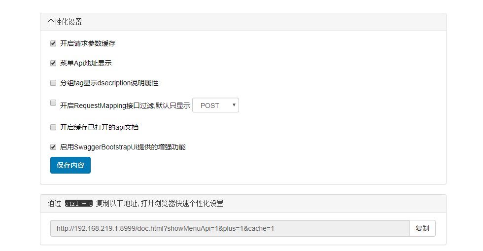

在`1.9.2`版本中,新增了可以通过参数来快速设置个性化配置的功能

使用场景：A:后端工程师  B:前端开发工程师

**在1.9.2版本之前**

```text
A:我已经完成了接口的开发,也已经开启了SwaggerBootstrapUi的增强功能,并且在本地联调测试通过,可以发给B了

B：收到文档地址，http://ip:port/doc.html

A:B，你首先打开文档管理 -> 个性化配置  开启SwaggerBootstrapUi的增强功能，可以排序，接口更清晰呀

B：好的~~!!（PS:就不能直接给弄好吗? o(╥﹏╥)o）
```

通过以上一个场景,我想大多数开发同学都觉得很麻烦~~还需要前端的开发一顿操作,就不能直接给弄好吗? o(╥﹏╥)o

**自1.9.2版本之后**

为解决以上的问题,自1.9.2版本后，加入了通过浏览器参数来快速配置个性化配置的功能,前端开发无需关注文档排序、是否开启缓存等操作,只要后端觉得该个性化功能合理,直接通过地址发给前端即可

界面如下：



后端同学自测后,将配置好的个性化配置功能保存，通过复制接口地址即可分享给前端同学,前端同学就可以不用操作任何配置了，直接对接接口即可.

## 关于个性化配置参数说明

- 开启请求参数缓存：`cache=1`

- 菜单Api地址显示: `showMenuApi=1`

- 分组tag显示dsecription说明属性: `showDes=1`

- 开启RequestMapping接口过滤,默认只显示: `filterApi=1`  `filterApiType=post`

- 开启缓存已打开的api文档:`cacheApi=1`

- 启用SwaggerBootstrapUi提供的增强功能:`plus=1`